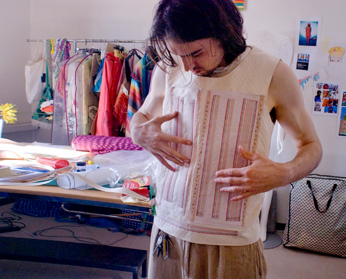

# Electric Ribbon Embedded

This repo hosts the code for the software embedded on the Electric Ribbon
microprocessors.

The prototype circuit board hosting the microcontroller and optimized for Qtouch.

## Textilen and the Electric Ribbon

This is part of a 2-year project, completed in 2010, involving the development of textile-­based modules and inter­faces for the con­trol and syn­the­sis of music during per­for­mance. A tex­tile in­stru­ment pro­vides a na­tur­al link be­tween action and sound, en­abl­ing al­ter­na­tive comp­o­si­tions and im­prov­isa­tions im­possible with tradi­tional in­stru­ments.

## Wireless Sensors

The Electric Ribbon system includes 3 parts.

1. A microprocessor embedded in the clothing, capable of detecting capacitive touches as buttons or sliding gestures (including proximity based gestures) and relaying them via wireless signals. 
2. Driver software running on a laptop or desktop that reads the wireless protocol and converts the signals into button presses on the device.
3. Plugin code for multimedia software, like a synthesizer patch in a program like Ableton Live.

With these three elements combined, a user can control the multimedia software remotely simply by interacting with their clothes.

## Technicals

This code depends on the QTouch Library, which is a capacitive sensing helper library compatible with some Atmel processors.

We use a custom protocol to remotely configure the QTouch system of the device to match both the current garment being worn and the desired interface for the multimedia software. This can then be stored in EEPROM of the device.

## Images

An example of interacting with the prototype.

A sample of the multilayer material used, which includes a ground plane to reduce noise from the body.

A sample vest used for performance.

Ideallized product vision.

An example of a material test done to minimize noise. Date from these results can be seen [here](material_tests/).
